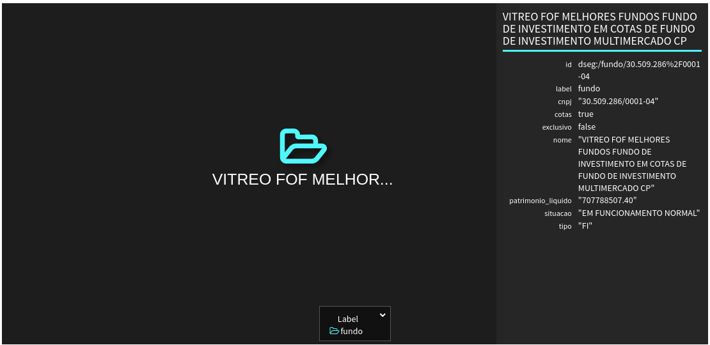
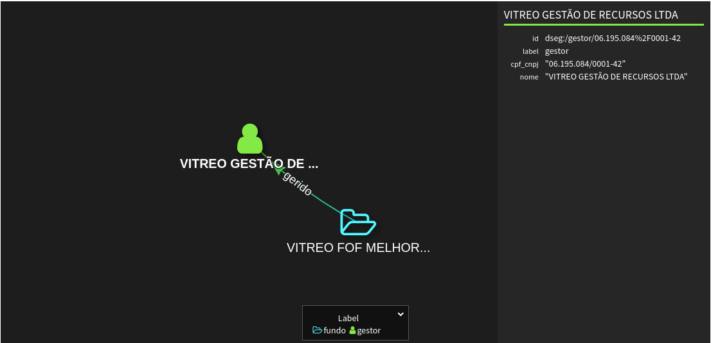
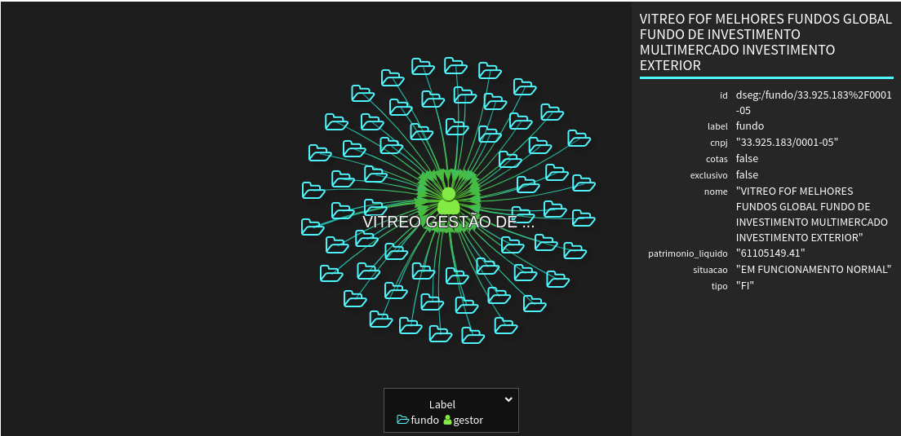
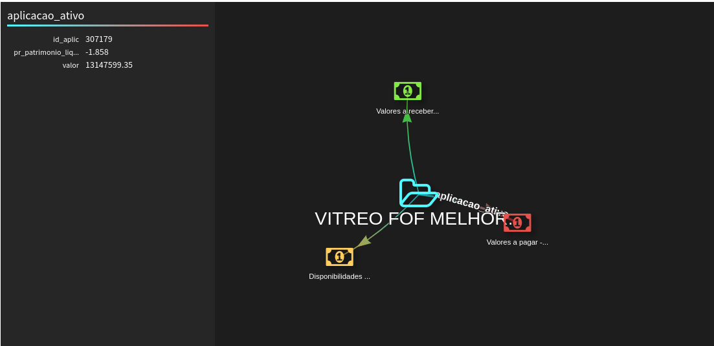
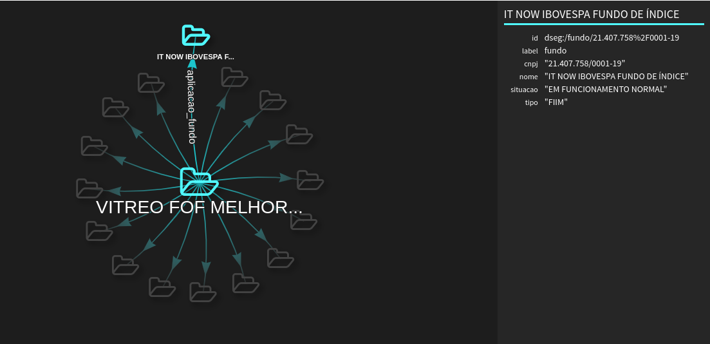

# Consultas ao Grafo __carteira_fundos__

Para ser executado em uma console Gremlin (por exemplo, em células de um [notebook Datastax Studio](BI-Master-consulta-grafo.studio-nb.tar)).

Referências: 

[Getting Started](https://tinkerpop.apache.org/docs/3.4.10/tutorials/getting-started/)

[Gremlin’s Anatomy](https://tinkerpop.apache.org/docs/current/tutorials/gremlins-anatomy/)

[Recipes](https://tinkerpop.apache.org/docs/current/recipes/#_recipes)

[PRACTICAL GREMLIN: An Apache TinkerPop Tutorial](http://kelvinlawrence.net/book/Gremlin-Graph-Guide.html)

## 1. Dados cadastrais e patrimônio líquido do fundo

### Definição do fundo para consulta
```
def cnpj_fundo='30.509.286/0001-04'
```
### Vértice do fundo
```
g.V()
    .hasLabel('fundo')
    .has('cnpj',cnpj_fundo)
```


### Propriedades do fundo (formato JSON)
```
g.V()
    .hasLabel('fundo')
    .has('cnpj',cnpj_fundo)
    .project('cnpj','nome','tipo','cotas','exclusivo','situacao','patrimonio_liquido')
    .by('cnpj')
    .by('nome')
    .by('tipo')
    .by(coalesce(values('cotas'), constant('-')))
    .by(coalesce(values('exclusivo'), constant('-')))
    .by(coalesce(values('situacao'), constant('-')))
    .by(coalesce(values('patrimonio_liquido'), constant('-')))
```
[Resultado](resultados-consulta/1-fundo.json)

## 2. Gestores do fundo

### Grafo com os gestor(es) do fundo
```
g.V()
    .hasLabel('fundo')
    .has('cnpj',cnpj_fundo)
    .outE('gerido')
```


### Gestor(es) do fundo (formato JSON)

```
g.V()
    .hasLabel('fundo')
    .has('cnpj',cnpj_fundo)
    .out('gerido')
    .project('cpf_cnpj','nome')
    .by('cpf_cnpj')
    .by('nome')
```
[Resultado](resultados-consulta/2-gestores-fundo.json)

## 2.1. Fundos de mesmos gestores

### Grafo com fundos de mesmo(s) gestor(es)
```
g.V()
    .hasLabel('fundo')
    .has('cnpj',cnpj_fundo)
    .out('gerido')
    .inE('gerido')
```


### Fundos de mesmo(s) gestor(es) (formato JSON)

```
g.V()
    .hasLabel('fundo')
    .has('cnpj',cnpj_fundo)
    .out('gerido')
    .in('gerido')
    .project('cnpj','nome')
    .by('cnpj')
    .by('nome')
```
[Resultado](resultados-consulta/2-1-fundos-mesmo-gestor.json)

## 3. Composição da carteira

## 3.1. Carteira de ativos

### Grafo com as aplicações do fundo em ativos financeiros e respectivos emissores (quando identificados)
```
g.V()
    .hasLabel('fundo')
    .has('cnpj',cnpj_fundo)
    .union(
    outE('aplicacao_ativo'),
    out('aplicacao_ativo').outE('emitido')
    )
```


### Aplicações do fundo em ativos financeiros e respectivos emissores (quando identificados) (formato JSON)

```
g.V()
    .hasLabel('fundo')
    .has('cnpj',cnpj_fundo)
    .outE('aplicacao_ativo')
    .project('ativo','isin','ticker','pr_patrimonio_liquido','mercado_negociacao','pais','data_vencimento','cpf_cnpj_emissor','emissor')
    .by(coalesce(__.inV().values('descricao'),constant('-')))
    .by(coalesce(__.inV().values('isin'),constant('-')))
    .by(coalesce(__.inV().values('ticker'),constant('-')))
    .by('pr_patrimonio_liquido')
    .by(coalesce(__.inV().values('mercado_negociacao'),constant('-')))
    .by(coalesce(__.inV().values('pais'),constant('-')))
    .by(coalesce(__.inV().values('data_vencimento'),constant('-')))
    .by(coalesce(__.inV().out('emitido').values('cpf_cnpj'),constant('-')))
    .by(coalesce(__.inV().out('emitido').values('nome'),constant('-')))
```
[Resultado](resultados-consulta/3-1-carteira-ativos.json)

## 3.2. Carteira de fundos investidos

### Grafo com as aplicações do fundo em cotas de outros fundos
```
g.V()
    .hasLabel('fundo')
    .has('cnpj',cnpj_fundo)
    .outE('aplicacao_fundo')
```


### Aplicações do fundo em cotas de outros fundos (formato JSON)

```
g.V()
    .hasLabel('fundo')
    .has('cnpj',cnpj_fundo)
    .outE('aplicacao_fundo')
    .project('cnpj_fundo_aplicado','fundo_aplicado','tipo','pr_patrimonio_liquido')
    .by(__.inV().values('cnpj'))
    .by(__.inV().values('nome'))
    .by(__.inV().values('tipo'))
    .by('pr_patrimonio_liquido')
```
[Resultado](resultados-consulta/3-2-carteira-cotas.json)


