# Consultas ao Grafo __carteira_fundos__

Para ser executado em uma console Gremlin (por exemplo, em células de um [notebook Datastax Studio](BI-Master-consulta-grafo.studio-nb.tar)).

Esta página apresenta o código das consultas Gremlin e os resultados obtidos para os seguintes vértices do grafo:
* Fundo CNPJ: 30.509.286/0001-04 (VITREO FOF MELHORES FUNDOS FUNDO DE INVESTIMENTO EM COTAS DE FUNDO DE INVESTIMENTO MULTIMERCADO CP)
* Fundo CNPJ: 08.912.591/0001-85 (JGP MAX FUNDO DE INVESTIMENTO EM COTAS DE FUNDOS DE INVESTIMENTO MULTIMERCADO)
* Ativo [ISIN: BRVIVTDBS069 (DEBENTURES SIMPLES TELEFONICA BRASIL SA)](http://bvmf.bmfbovespa.com.br/consulta-isin/DetalheCodigosIsin.aspx?idioma=pt-BR&codigo=BRVIVTDBS069)

Posição da carteira dos fundos no grafo consultado: 11/2020.

Arquivo de dump do grafo consultado: [dse-unload-files.tar.gz](dse-unload-files.tar.gz).

## 1. Dados cadastrais e patrimônio líquido do fundo

### Definição do fundo para consulta
```
def cnpj_fundo='30.509.286/0001-04'
```
### Vértice do fundo
```
g.V()
    .hasLabel('fundo')
    .has('cnpj',cnpj_fundo)
```


### Propriedades do fundo (representação JSON)
```
g.V()
    .hasLabel('fundo')
    .has('cnpj',cnpj_fundo)
    .project('cnpj','nome','tipo','cotas','exclusivo','situacao','patrimonio_liquido')
    .by('cnpj')
    .by('nome')
    .by('tipo')
    .by(coalesce(values('cotas'), constant('-')))
    .by(coalesce(values('exclusivo'), constant('-')))
    .by(coalesce(values('situacao'), constant('-')))
    .by(coalesce(values('patrimonio_liquido'), constant('-')))
```
[Resultado](resultados-consulta/1-fundo.json)

## 2. Gestores do fundo

### Grafo com os gestor(es) do fundo
```
g.V()
    .hasLabel('fundo')
    .has('cnpj',cnpj_fundo)
    .outE('gerido')
```


### Gestor(es) do fundo (representação JSON)

```
g.V()
    .hasLabel('fundo')
    .has('cnpj',cnpj_fundo)
    .out('gerido')
    .project('cpf_cnpj','nome')
    .by('cpf_cnpj')
    .by('nome')
```
[Resultado](resultados-consulta/2-gestores-fundo.json)

## 2.1. Fundos de mesmos gestores

### Grafo com fundos de mesmo(s) gestor(es)
```
g.V()
    .hasLabel('fundo')
    .has('cnpj',cnpj_fundo)
    .out('gerido')
    .inE('gerido')
```


### Fundos de mesmo(s) gestor(es) (representação JSON)

```
g.V()
    .hasLabel('fundo')
    .has('cnpj',cnpj_fundo)
    .out('gerido')
    .in('gerido')
    .project('cnpj','nome')
    .by('cnpj')
    .by('nome')
```
[Resultado](resultados-consulta/2-1-fundos-mesmo-gestor.json)

## 3. Composição da carteira

## 3.1. Carteira de ativos

### Grafo com as aplicações do fundo em ativos financeiros e respectivos emissores (quando identificados)
```
g.V()
    .hasLabel('fundo')
    .has('cnpj',cnpj_fundo)
    .union(
    outE('aplicacao_ativo'),
    out('aplicacao_ativo').outE('emitido')
    )
```


### Aplicações do fundo em ativos financeiros e respectivos emissores (quando identificados) (representação JSON)

```
g.V()
    .hasLabel('fundo')
    .has('cnpj',cnpj_fundo)
    .outE('aplicacao_ativo')
    .project('ativo','isin','ticker','pr_patrimonio_liquido','mercado_negociacao','pais','data_vencimento','cpf_cnpj_emissor','emissor')
    .by(coalesce(__.inV().values('descricao'),constant('-')))
    .by(coalesce(__.inV().values('isin'),constant('-')))
    .by(coalesce(__.inV().values('ticker'),constant('-')))
    .by('pr_patrimonio_liquido')
    .by(coalesce(__.inV().values('mercado_negociacao'),constant('-')))
    .by(coalesce(__.inV().values('pais'),constant('-')))
    .by(coalesce(__.inV().values('data_vencimento'),constant('-')))
    .by(coalesce(__.inV().out('emitido').values('cpf_cnpj'),constant('-')))
    .by(coalesce(__.inV().out('emitido').values('nome'),constant('-')))
```
[Resultado](resultados-consulta/3-1-carteira-ativos.json)

## 3.2. Carteira de fundos investidos

### Grafo com as aplicações do fundo em cotas de outros fundos
```
g.V()
    .hasLabel('fundo')
    .has('cnpj',cnpj_fundo)
    .outE('aplicacao_fundo')
```


### Aplicações do fundo em cotas de outros fundos (representação JSON)

```
g.V()
    .hasLabel('fundo')
    .has('cnpj',cnpj_fundo)
    .outE('aplicacao_fundo')
    .project('cnpj_fundo_aplicado','fundo_aplicado','tipo','pr_patrimonio_liquido')
    .by(__.inV().values('cnpj'))
    .by(__.inV().values('nome'))
    .by(__.inV().values('tipo'))
    .by('pr_patrimonio_liquido')
```
[Resultado](resultados-consulta/3-2-carteira-cotas.json)

## 3.2.1. Fundos investidos e seus gestores

### Grafo com as aplicações do fundo em cotas de outros fundos e respectivos gestores (quando identificados)
```
g.V()
    .hasLabel('fundo')
    .has('cnpj',cnpj_fundo)
    .union(
    outE('gerido'),
    outE('aplicacao_fundo'),
    out('aplicacao_fundo').outE('gerido')
    )
```
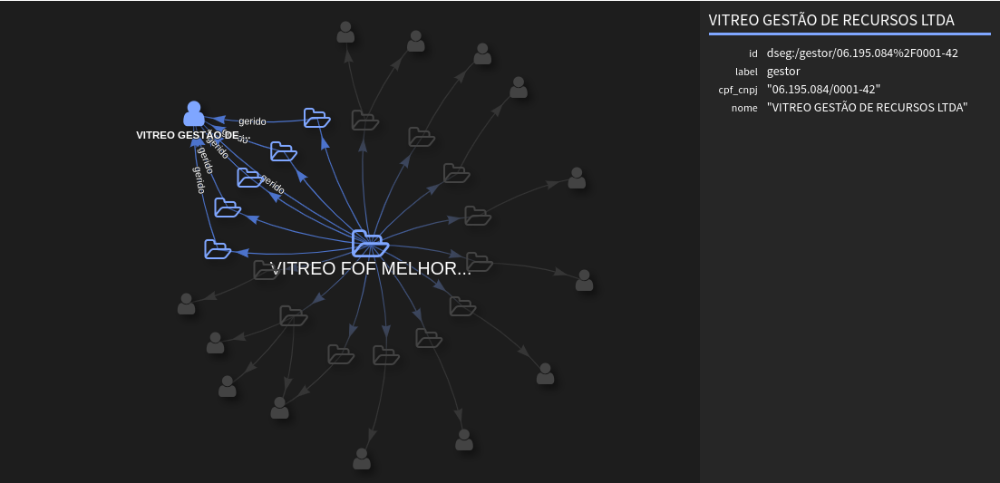

### Aplicações do fundo em cotas de outros fundos e respectivos gestores (quando identificados) (representação JSON)
```
g.V()
    .hasLabel('fundo')
    .has('cnpj',cnpj_fundo)
    .union(
        out('gerido')
            .project('cpf_cnpj_gestor_fundo','gestor_fundo')
                .by('cpf_cnpj')
                .by('nome'),
        outE('aplicacao_fundo')
        .union(
            project('cnpj_fundo_aplicado','fundo_aplicado','pr_patrimonio_liquido')
                .by(__.inV().values('cnpj'))
                .by(__.inV().values('nome'))
                .by('pr_patrimonio_liquido'),
            inV().as('aplicacao_fundo').out('gerido')
                .project('cnpj_fundo_aplicado','cpf_cnpj_gestor_fundo_aplicado','gestor_fundo_aplicado')
                .by(select('aplicacao_fundo').values('cnpj'))
                .by(coalesce(values('cpf_cnpj')))
                .by(coalesce(values('nome')))
        )
    )
```
[Resultado](resultados-consulta/3-2-1-fundos-cotas-gestores.json)

## 3.3. Carteira simples (ativos e fundos investidos)

Aplicações do fundo: ativos financeiros e respectivos emissores (quando identificados) e cotas de outros fundos

### Grafo com todas as aplicações do fundo
```
g.V()
    .hasLabel('fundo')
    .has('cnpj',cnpj_fundo)
    .union(
    
        // ativos na carteira
        outE('aplicacao_ativo'),

        // emissores dos ativos na carteira
        outE('aplicacao_ativo')
            .inV().outE('emitido'),
            
        // fundos investidos
        outE('aplicacao_fundo')
    )
```
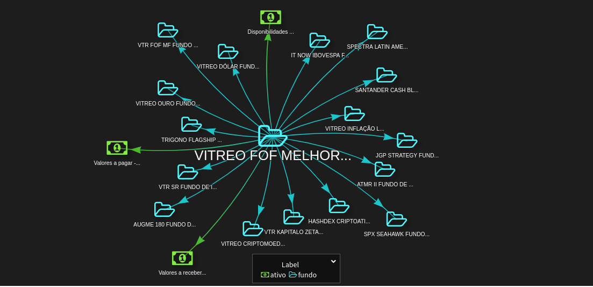

### Aplicações do fundo (representação JSON)
```
g.V()
    .hasLabel('fundo')
    .has('cnpj',cnpj_fundo)
    .union(
        // ativos na carteira e seus emissores
        outE('aplicacao_ativo')
            .project('ativo','isin','ticker','pr_patrimonio_liquido','mercado_negociacao','pais','data_vencimento','cpf_cnpj_emissor','emissor')
            .by(coalesce(__.inV().values('descricao'),constant('-')))
            .by(coalesce(__.inV().values('isin'),constant('-')))
            .by(coalesce(__.inV().values('ticker'),constant('-')))
            .by('pr_patrimonio_liquido')
            .by(coalesce(__.inV().values('mercado_negociacao'),constant('-')))
            .by(coalesce(__.inV().values('pais'),constant('-')))
            .by(coalesce(__.inV().values('data_vencimento'),constant('-')))
            .by(coalesce(__.inV().out('emitido').values('cpf_cnpj'),constant('-')))
            .by(coalesce(__.inV().out('emitido').values('nome'),constant('-'))),

        // fundos investidos
        outE('aplicacao_fundo').as('aplicacao_fundo')
            .project('cnpj_fundo','fundo','tipo','pr_patrimonio_liquido')
            .by(__.inV().values('cnpj'))
            .by(__.inV().values('nome'))
            .by(__.inV().values('tipo'))
            .by('pr_patrimonio_liquido')
            )
```
[Resultado](resultados-consulta/3-3-carteira-consolidada.json)

## 3.4. Carteira expandida (ativos e fundos investidos direta ou diretamente) - Nível 1

Aplicações do fundo: ativos financeiros e respectivos emissores (quando identificados), cotas de outros fundos e os ativos que compõem a carteira dos fundos investidos). 

A busca no grafo atravessa as arestas aplicacao_fundo, apenas uma vez (nível de profundidade = 1).

Para não poluir o grafo, não são incluídas as aplicações que representam entre -0.5% e 0.5% do patrimônio líquido do fundo. (O percentual do patrimônio líquido representado pela aplicação pode ser negativo).

### Valor percentual limite para filtrar as aplicações, em relação ao patrimônio líquido do fundo
```
def limiar_pr_pl=0.5
```
### Grafo com a carteira expandida do fundo
```
g.V()
    .hasLabel('fundo')
    .has('cnpj',cnpj_fundo)
    .union(
        // ativos na carteira
        outE('aplicacao_ativo')
            .has('pr_patrimonio_liquido',outside(-limiar_pr_pl,limiar_pr_pl)), 

        // emissores dos ativos na carteira
        outE('aplicacao_ativo')
            .has('pr_patrimonio_liquido',outside(-limiar_pr_pl,limiar_pr_pl))
        .inV().outE('emitido'),
            
        // fundos investidos
        outE('aplicacao_fundo')
            .has('pr_patrimonio_liquido',outside(-limiar_pr_pl,limiar_pr_pl)),

        // ativos nas carteiras dos fundos investidos
        outE('aplicacao_fundo')
            .has('pr_patrimonio_liquido',outside(-limiar_pr_pl,limiar_pr_pl))
        .inV().outE('aplicacao_ativo')
            .has('pr_patrimonio_liquido',outside(-limiar_pr_pl,limiar_pr_pl)),
            
        // emissores dos ativos nas carteiras dos fundos investidos
        outE('aplicacao_fundo')
            .has('pr_patrimonio_liquido',outside(-limiar_pr_pl,limiar_pr_pl))
        .inV().outE('aplicacao_ativo')
            .has('pr_patrimonio_liquido',outside(-limiar_pr_pl,limiar_pr_pl))
        .inV().outE('emitido')
    )
```
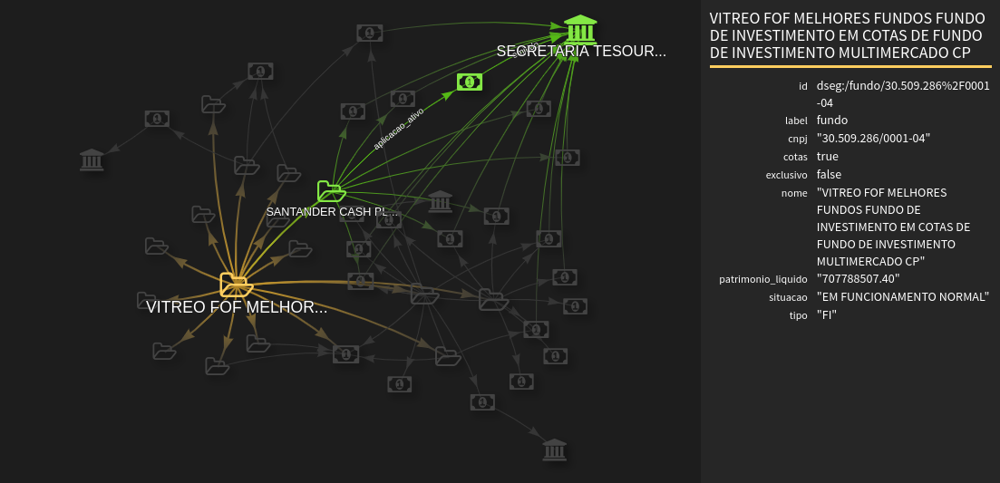

### Carteira expandida do fundo (representação JSON)
```
g.V()
    .hasLabel('fundo')
    .has('cnpj',cnpj_fundo)
    .union(
        // ativos na carteira e seus emissores
        outE('aplicacao_ativo')
            .has('pr_patrimonio_liquido',outside(-limiar_pr_pl,limiar_pr_pl))
        .project('ativo','isin','ticker','pr_patrimonio_liquido','mercado_negociacao','pais','data_vencimento','cpf_cnpj_emissor','emissor')
            .by(coalesce(__.inV().values('descricao'),constant('-')))
            .by(coalesce(__.inV().values('isin'),constant('-')))
            .by(coalesce(__.inV().values('ticker'),constant('-')))
            .by('pr_patrimonio_liquido')
            .by(coalesce(__.inV().values('mercado_negociacao'),constant('-')))
            .by(coalesce(__.inV().values('pais'),constant('-')))
            .by(coalesce(__.inV().values('data_vencimento'),constant('-')))
            .by(coalesce(__.inV().out('emitido').values('cpf_cnpj'),constant('-')))
            .by(coalesce(__.inV().out('emitido').values('nome'),constant('-'))),

        repeat(outE('aplicacao_fundo')
            .has('pr_patrimonio_liquido',outside(-limiar_pr_pl,limiar_pr_pl))
            .as('aplicacao_fundo')
        .inV())
        .times(1).emit()
        .union(
            // fundos investidos 
            project('cnpj_fundo_investidor','cnpj_fundo_investido','fundo_investido','tipo','pr_patrimonio_liquido_fundo')
                .by(select('aplicacao_fundo').otherV().values('cnpj'))
                .by('cnpj')
                .by('nome')
                .by('tipo')
                .by(select('aplicacao_fundo').values('pr_patrimonio_liquido')),
                
            // ativos nas carteiras dos fundos investidos e seus emissores
            outE('aplicacao_ativo')
                .has('pr_patrimonio_liquido',outside(-limiar_pr_pl,limiar_pr_pl))
            .project('cnpj_fundo_investido','ativo','isin','ticker','pr_patrimonio_liquido_ativo','mercado_negociacao','pais','data_vencimento','cpf_cnpj_emissor','emissor')
                .by(select('aplicacao_fundo').inV().values('cnpj'))
                .by(coalesce(__.inV().values('descricao'),constant('-')))
                .by(coalesce(__.inV().values('isin'),constant('-')))
                .by(coalesce(__.inV().values('ticker'),constant('-')))
                .by('pr_patrimonio_liquido')
                .by(coalesce(__.inV().values('mercado_negociacao'),constant('-')))
                .by(coalesce(__.inV().values('pais'),constant('-')))
                .by(coalesce(__.inV().values('data_vencimento'),constant('-')))
                .by(coalesce(__.inV().out('emitido').values('cpf_cnpj'),constant('-')))
                .by(coalesce(__.inV().out('emitido').values('nome'),constant('-')))            
            )
        )
```
[Resultado](resultados-consulta/3-4-carteira-expandida.json)

## 3.5. Carteira expandida (ativos e fundos investidos direta ou diretamente) - Nível 2

Aplicações do fundo: ativos financeiros e respectivos emissores (quando identificados), cotas de outros fundos e os ativos que compõem a carteira dos fundos investidos). 

A busca no grafo atravessa as arestas aplicacao_fundo 2 vezes (nível de profundidade = 2).

Para não poluir o grafo, não são incluídas as aplicações que representam entre -0.5% e 0.5% do patrimônio líquido do fundo. (O percentual do patrimônio líquido representado pela aplicação pode ser negativo).

### Grafo com a carteira expandida do fundo
```
g.V()
    .hasLabel('fundo')
    .has('cnpj',cnpj_fundo)
    .union(
        // ativos na carteira 
        outE('aplicacao_ativo')
            .has('pr_patrimonio_liquido',outside(-limiar_pr_pl,limiar_pr_pl)), 

        // emissores dos ativos na carteira 
        outE('aplicacao_ativo')
            .has('pr_patrimonio_liquido',outside(-limiar_pr_pl,limiar_pr_pl))
        .inV().outE('emitido'),
		
        // fundos investidos 
        repeat(outE('aplicacao_fundo')
            .has('pr_patrimonio_liquido',outside(-limiar_pr_pl,limiar_pr_pl))
            .as('aplicacao_fundo')
        .inV())
        .times(2).emit().dedup()
        .select('aplicacao_fundo'),

        // ativos nas carteiras dos fundos investidos 
        repeat(outE('aplicacao_fundo')
            .has('pr_patrimonio_liquido',outside(-limiar_pr_pl,limiar_pr_pl))
            .as('aplicacao_fundo')
        .inV())
        .times(2).emit().dedup()
        .outE('aplicacao_ativo')
            .has('pr_patrimonio_liquido',outside(-limiar_pr_pl,limiar_pr_pl)),

        // emissores dos ativos nas carteiras dos fundos investidos 
        repeat(outE('aplicacao_fundo')
            .has('pr_patrimonio_liquido',outside(-limiar_pr_pl,limiar_pr_pl))
            .as('aplicacao_fundo')
        .inV())
        .times(2).emit().dedup()
        .outE('aplicacao_ativo')
            .has('pr_patrimonio_liquido',outside(-limiar_pr_pl,limiar_pr_pl))
        .inV().outE('emitido')
    )
```
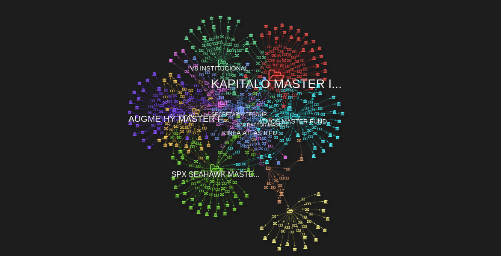

### Carteira expandida do fundo (representação JSON)
```
g.V()
    .hasLabel('fundo')
    .has('cnpj',cnpj_fundo)
    .union(
        // ativos na carteira e seus emissores
        outE('aplicacao_ativo')
            .has('pr_patrimonio_liquido',outside(-limiar_pr_pl,limiar_pr_pl))
        .project('ativo','isin','ticker','pr_patrimonio_liquido','mercado_negociacao','pais','data_vencimento','cpf_cnpj_emissor','emissor')
            .by(coalesce(__.inV().values('descricao'),constant('-')))
            .by(coalesce(__.inV().values('isin'),constant('-')))
            .by(coalesce(__.inV().values('ticker'),constant('-')))
            .by('pr_patrimonio_liquido')
            .by(coalesce(__.inV().values('mercado_negociacao'),constant('-')))
            .by(coalesce(__.inV().values('pais'),constant('-')))
            .by(coalesce(__.inV().values('data_vencimento'),constant('-')))
            .by(coalesce(__.inV().out('emitido').values('cpf_cnpj'),constant('-')))
            .by(coalesce(__.inV().out('emitido').values('nome'),constant('-'))),

        repeat(outE('aplicacao_fundo')
            .has('pr_patrimonio_liquido',outside(-limiar_pr_pl,limiar_pr_pl))
            .as('aplicacao_fundo')
        .inV())
        .times(2).emit().dedup()
        .union(
            // fundos investidos 
            project('cnpj_fundo_investidor','cnpj_fundo_investido','fundo_investido','tipo','pr_patrimonio_liquido_fundo')
                .by(select('aplicacao_fundo').otherV().values('cnpj'))
                .by('cnpj')
                .by('nome')
                .by('tipo')
                .by(select('aplicacao_fundo').values('pr_patrimonio_liquido')),
                
            // ativos nas carteiras dos fundos investidos e seus emissores
            outE('aplicacao_ativo')
                .has('pr_patrimonio_liquido',outside(-limiar_pr_pl,limiar_pr_pl))
            .project('cnpj_fundo_investido','ativo','isin','ticker','pr_patrimonio_liquido_ativo','mercado_negociacao','pais','data_vencimento','cpf_cnpj_emissor','emissor')
                .by(select('aplicacao_fundo').inV().values('cnpj'))
                .by(coalesce(__.inV().values('descricao'),constant('-')))
                .by(coalesce(__.inV().values('isin'),constant('-')))
                .by(coalesce(__.inV().values('ticker'),constant('-')))
                .by('pr_patrimonio_liquido')
                .by(coalesce(__.inV().values('mercado_negociacao'),constant('-')))
                .by(coalesce(__.inV().values('pais'),constant('-')))
                .by(coalesce(__.inV().values('data_vencimento'),constant('-')))
                .by(coalesce(__.inV().out('emitido').values('cpf_cnpj'),constant('-')))
                .by(coalesce(__.inV().out('emitido').values('nome'),constant('-')))            
            )
        )
```
[Resultado](resultados-consulta/3-5-carteira-expandida.json)

## 4. Fundos investidores

### Definição do fundo para consulta
```
def cnpj_fundo='08.912.591/0001-85'
```
## 4.1. Fundos investidores diretos

A busca no grafo atravessa as arestas **aplicacao_fundo, apenas uma vez**.

### Grafo com fundos investidores diretos
```
g.V()
    .hasLabel('fundo')
    .has('cnpj',cnpj_fundo)
    .inE('aplicacao_fundo')
```    
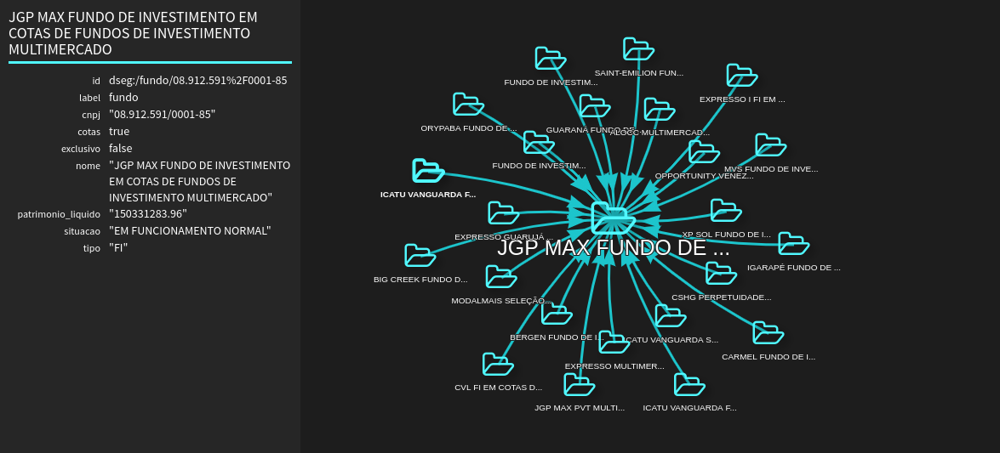

### Fundos investidores diretos (representação JSON)
```    
g.V()
    .hasLabel('fundo')
    .has('cnpj',cnpj_fundo)
    .inE('aplicacao_fundo')
    .project('cnpj_fundo_investidor', 'fundo_investidor', 'tipo', 'pr_patrimonio_liquido')
    .by(__.outV().values('cnpj'))
    .by(__.outV().values('nome'))
    .by(__.outV().values('tipo'))
    .by('pr_patrimonio_liquido')
```    
[Resultado](resultados-consulta/4-1-fundos-investidores.json)

## 4.2. Fundos investidores diretos e indiretos

A busca no grafo atravessa as arestas **aplicacao_fundo, tantas vezes quanto possível**.

### Grafo com fundos investidores diretos e indiretos
```
g.V()
    .hasLabel('fundo')
    .has('cnpj',cnpj_fundo)
    .repeat(inE('aplicacao_fundo')
        .as('aplicacao_fundo')
    .outV()
    .simplePath()).emit().dedup()
    .select('aplicacao_fundo')
```
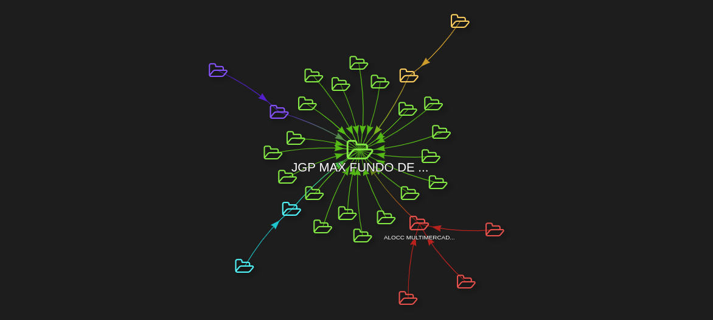

### Fundos investidores diretos e indiretos (representação JSON)
```
g.V()
    .hasLabel('fundo')
    .has('cnpj',cnpj_fundo)
    .repeat(inE('aplicacao_fundo')
        .as('aplicacao_fundo')
    .outV()
    .simplePath()).emit().dedup()
        .project('cnpj_fundo_investido', 'cnpj_fundo_investidor', 'fundo_investidor', 'tipo', 'pr_patrimonio_liquido')
            .by(select('aplicacao_fundo').otherV().values('cnpj'))
            .by('cnpj')
            .by('nome')
            .by('tipo')
            .by(select('aplicacao_fundo').values('pr_patrimonio_liquido'))
```
[Resultado](resultados-consulta/4-2-fundos-investidores.json)

## 4.2.1. Fundos investidores diretos e indiretos e seus gestores

A busca no grafo atravessa as arestas **aplicacao_fundo, tantas vezes quanto possível**.

### Grafo com fundos investidores diretos e indiretos e respectivos gestores (quando identificados)
```
g.V()
    .hasLabel('fundo')
    .has('cnpj',cnpj_fundo)
        .as('fundo')
    .union(
        select('fundo').outE('gerido'),
        repeat(inE('aplicacao_fundo')
            .as('aplicacao_fundo')
        .outV()
        .simplePath()).emit().dedup()
        .union(
            select('aplicacao_fundo'),
            outE('gerido')
        )
    )
```
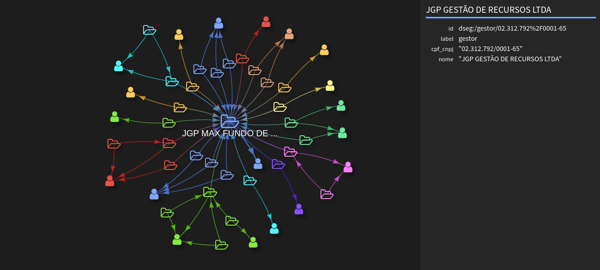

### Fundos investidores diretos e indiretos e respectivos gestores (quando identificados) (representação JSON)
```
g.V()
    .hasLabel('fundo')
    .has('cnpj',cnpj_fundo)
    .union(
        project('cpf_cnpj_gestor_fundo', 'gestor_fundo')
            .by(__.out('gerido').values('cpf_cnpj'))
            .by(__.out('gerido').values('nome')),
            
        repeat(inE('aplicacao_fundo')
            .as('aplicacao_fundo')
        .outV()
        .simplePath()).emit().dedup()
        .union(
            project('cnpj_fundo_investido', 'cnpj_fundo_investidor', 'fundo_investidor', 'tipo', 'pr_patrimonio_liquido')
                .by(select('aplicacao_fundo').otherV().values('cnpj'))
                .by('cnpj')
                .by('nome')
                .by('tipo')
                .by(select('aplicacao_fundo').values('pr_patrimonio_liquido')),
            outE('gerido')
                .project('cnpj_fundo_investidor', 'cpf_cnpj_gestor_fundo_investidor', 'gestor_fundo_investidor')
                    .by(__.outV().values('cnpj'))
                    .by(coalesce(__.inV().values('cpf_cnpj'), constant('-')))
                    .by(coalesce(__.inV().values('nome'), constant('-')))
        )
    )
```
[Resultado](resultados-consulta/4-2-1-fundos-investidores-gestores.json)

## 5. Consulta de ativo

### Definição do ativo para consulta
```
def isin='BRVIVTDBS069'
```

## 5.1. Identificação e emissor do ativo

### Grafo com o ativo e seu emissor (quando identificado)
```
g.V()
    .hasLabel('ativo')
    .has('isin',isin)
    .outE('emitido')
```
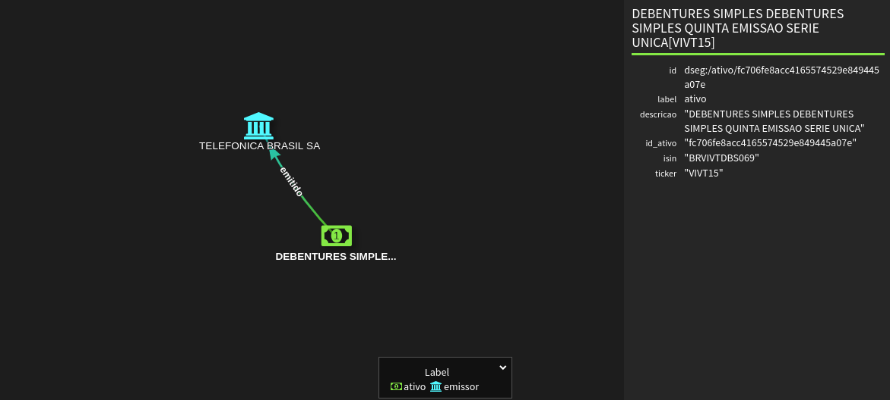

### Propriedades do ativo e seu emissor (quando identificado) (representação JSON)
```
g.V()
    .hasLabel('ativo')
    .has('isin',isin)
    .project('ativo','isin','ticker','mercado_negociacao','pais','data_vencimento','cpf_cnpj_emissor','emissor')
        .by(coalesce(values('descricao'),constant('-')))
        .by(coalesce(values('isin'),constant('-')))
        .by(coalesce(values('ticker'),constant('-')))
        .by(coalesce(values('mercado_negociacao'),constant('-')))
        .by(coalesce(values('pais'),constant('-')))
        .by(coalesce(values('data_vencimento'),constant('-')))
        .by(coalesce(out('emitido').values('cpf_cnpj'),constant('-')))
        .by(coalesce(out('emitido').values('nome'),constant('-')))
```
[Resultado](resultados-consulta/5-1-ativo.json)

## 5.1.1. Ativos de mesmo emissor

### Grafo com ativos de mesmo emissor
```
g.V()
    .hasLabel('ativo')
    .has('isin',isin)
    .out('emitido')
    .inE('emitido')
```
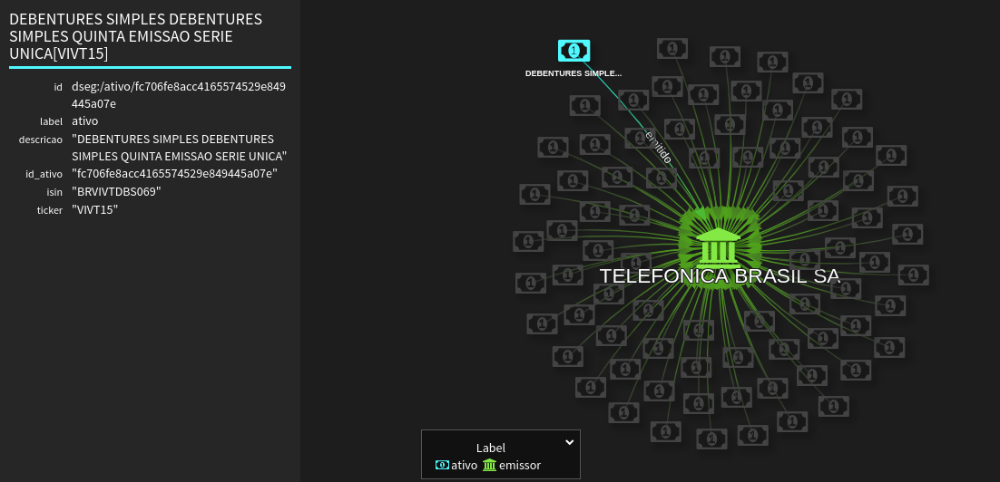
    
### Ativos de mesmo emissor (representação JSON)
```
g.V()
    .hasLabel('ativo')
    .has('isin',isin)
    .out('emitido')
    .in('emitido')
    .project('ativo','isin','ticker','mercado_negociacao','pais','data_vencimento')
        .by(coalesce(values('descricao'),constant('-')))
        .by(coalesce(values('isin'),constant('-')))
        .by(coalesce(values('ticker'),constant('-')))
        .by(coalesce(values('mercado_negociacao'),constant('-')))
        .by(coalesce(values('pais'),constant('-')))
        .by(coalesce(values('data_vencimento'),constant('-')))
```
[Resultado](resultados-consulta/5-1-1-ativos-mesmo-emissor.json)

## 5.2. Fundos investidores diretos no ativo

### Grafo com fundos investidores diretos no ativo
```
g.V()
    .hasLabel('ativo')
    .has('isin',isin)
    .inE('aplicacao_ativo')
```
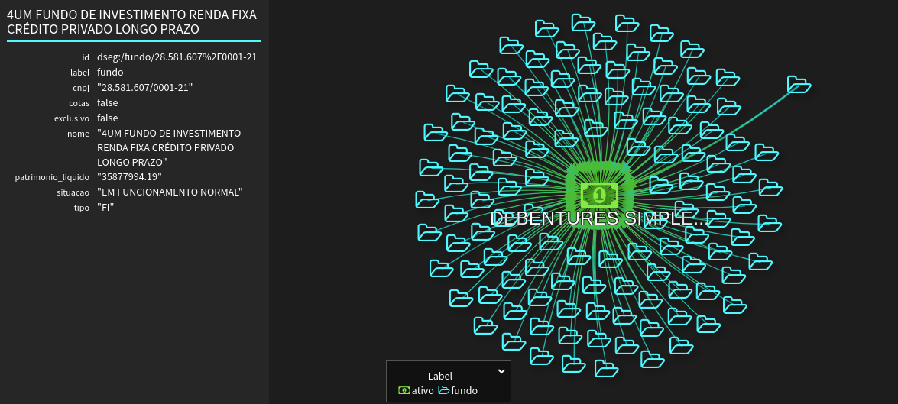

### Fundos investidores diretos no ativo e valor total das aplicações (representação JSON)
```
g.V()
    .hasLabel('ativo')
    .has('isin',isin)
    .union(
        inE('aplicacao_ativo')
        .project('cnpj_fundo_investidor', 'fundo_investidor', 'tipo', 'valor_aplicacao_fundo')
            .by(outV().values('cnpj'))
            .by(outV().values('nome'))
            .by(outV().values('tipo'))
            .by(values('valor')),
            
        project('valor_total_aplicacoes')
            .by(__.inE('aplicacao_ativo').values('valor').sum())
    )
```
[Resultado](resultados-consulta/5-2-fundos-investidores-ativo.json)

## 5.3. Gestores investidores diretos no ativo

### Grafo com gestores de fundos investidores diretos no ativo
```
g.V()
    .hasLabel('ativo')
    .has('isin',isin)
    .union(
        inE('aplicacao_ativo'),
        __.in('aplicacao_ativo').outE('gerido')
    )
```
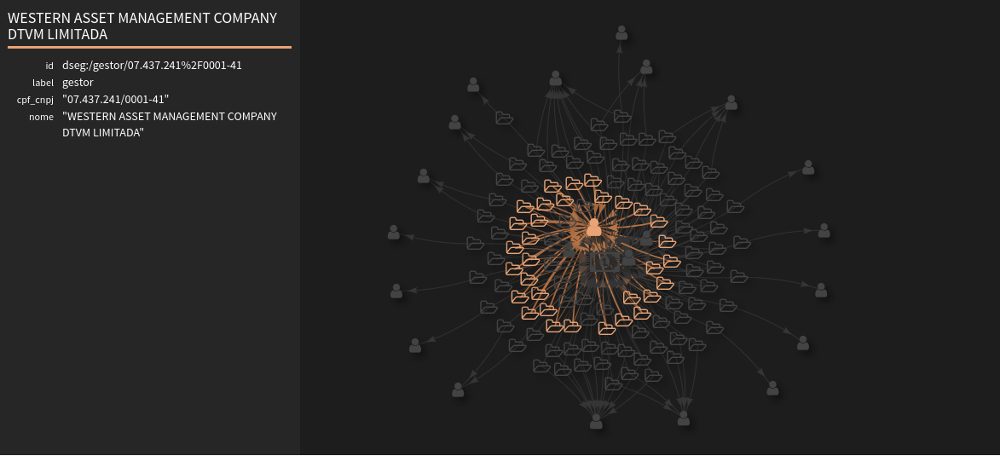

### Subgrafo com gestores de fundos investidores diretos no ativo
```
def grafo = g.V()
    .hasLabel('ativo')
    .has('isin',isin)
    .union(
        inE('aplicacao_ativo'),
        __.in('aplicacao_ativo').outE('gerido')
    )
    .subgraph('grafo')
    .cap('grafo')
    .next()
    
sg = grafo.traversal()
```

### Gestores de fundos investidores diretos no ativo (representação JSON)
```
def gestores = sg.V()
    .hasLabel('gestor')
    .values('cpf_cnpj').toList()

g.V()
    .has('gestor','cpf_cnpj', within(gestores))
    .project('cpf_cnpj_gestor', 'gestor')
    .by('cpf_cnpj')
    .by('nome')
```
[Resultado](resultados-consulta/5-3-gestores-investidores-ativo.json)
    
### Gestores de fundos investidores diretos no ativo e valor total das aplicações (representação JSON)
```
sg.E()
    .hasLabel('aplicacao_ativo')
    .outV().out('gerido').dedup()
    .project('cpf_cnpj_gestor', 'quantidade_fundos_investidores', 'valor_total_aplicacoes')
        .by(values('cpf_cnpj'))
        .by(__.in('gerido').count())
        .by(__.in('gerido').outE('aplicacao_ativo').values('valor').sum())
        .order().by(select('quantidade_fundos_investidores'), desc)
```
[Resultado](resultados-consulta/5-3-gestores-investidores-ativo-totais.json)
